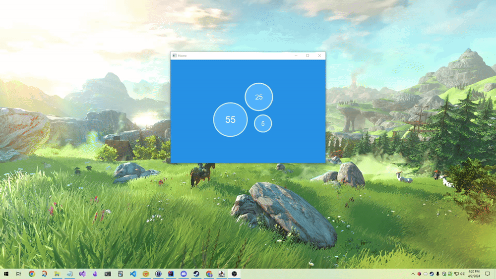

# Java Pomodoro Timer

## Preview

## Installation
- _pending_

## Planned Features
- Pomodoro clock
  - 25min, 55 min timers
  - Pause timer
  - Reset timer
  - Stop timer
- Track Pomodoro sessions
  - Duration
  - Date & time 
- Visual Feedback
  - During Pomodoro Session
    - Background color changes one line at a time from top to bottom every second to indicate time passing
    - I.e falling sands timers 
  - Pomodoro Session ends
    - Background color changes completely
    - Message is displayed
    - Sound is played

## References
- [inspired by cuckoo.team](https://cuckoo.team/)
- [Getting Started](https://skeoop.github.io/javafx/Getting-Started)
- [Official Setup Guide](https://openjfx.io/openjfx-docs/#introduction)
- [Open Source Documentation](https://fxdocs.github.io/docs/html5/#_introduction)